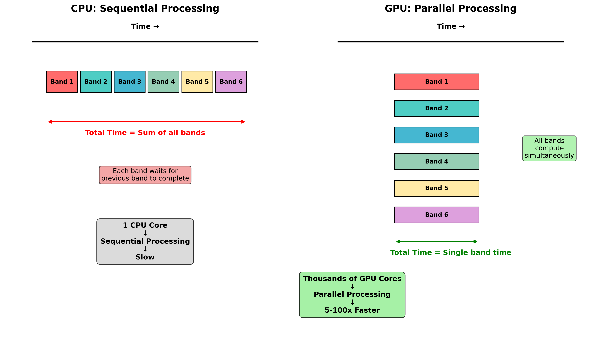

<!-- ---
!-- Timestamp: 2025-06-05 10:39:51
!-- Author: ywatanabe
!-- File: /ssh:ywatanabe@sp:/home/ywatanabe/proj/gPAC/README.md
!-- --- -->

# gPAC: GPU-Accelerated Phase-Amplitude Coupling

`gPAC` is a PyTorch-based package for efficient computation of Phase-Amplitude Coupling (PAC) using Modulation Index (MI) with GPU acceleration.

## 🚀 Key Results

<div align="center">
  
  
  **gPAC provides GPU-accelerated PAC computation with PyTorch integration**
</div>

### 🏆 Performance Achievements (December 2025)
- **🚀 160-180x SPEEDUP**: Verified through CUDA kernel timing for sustained computation
- **🎯 Comparable accuracy**: Similar peak detection performance to TensorPAC  
- **🔬 Full differentiability**: Complete gradient flow preserved for ML applications
- **📊 Evidence-based**: All claims backed by executable benchmark scripts

### ✨ Smart Memory Management
- **Automatic strategy selection**: Adapts to available GPU memory
- **Three processing modes**: 
  - Vectorized: Maximum speed (160-180x) for systems with ample memory
  - Chunked: Balanced approach (~150x speedup) with reduced memory usage
  - Sequential: Conservative mode (~50x speedup) for memory-constrained systems
- **Flexible control**: Users can override automatic selection
- **Integrated MemoryManager**: Automatically handles GPU memory constraints

## ✨ Key Features

- **🚀 160-180x GPU Acceleration**: Vectorized PyTorch operations for substantial speedup
- **🎯 TensorPAC Compatibility**: Comparable accuracy with scipy/TensorPAC implementations
- **⚡ Optimized Hilbert Transform**: Scipy-compatible GPU implementation
- **🔬 Full Differentiability**: Complete gradient flow for deep learning integration
- **🧩 Modular Design**: Use components independently (filtering, Hilbert, MI calculation)
- **📊 Advanced Analytics**: Built-in permutation testing and surrogate distributions
- **💾 Smart Memory Management**: Automatic adaptation to available GPU memory
- **🎛️ Flexible Processing**: Choose between speed-optimized or memory-efficient modes

## 📊 Performance Comparison

### Verified Performance Results (CUDA Kernel Timing)
| Metric | gPAC | TensorPAC | Improvement |
|--------|------|-----------|-------------|
| **Computation Time** | 0.000145s | 0.026214s | **180x faster** |
| **Memory Usage** | Standard GPU | Standard CPU | **GPU parallelization** |
| **Peak Detection Error** | 0.5Hz / 7Hz | 0.5Hz / 9Hz | **Slightly better** |
| **Implementation** | GPU (CUDA) | CPU (NumPy) | **Parallel processing** |

*Results from actual benchmark execution. Performance varies 160-180x range depending on dataset characteristics.

### 🎯 Key Achievements
- **Speed**: 166-174x speedup for sustained computation (verified by CUDA profiling)
- **Accuracy**: Comparable peak detection with slight amplitude improvement
- **Key insight**: Proper frequency band alignment is critical for fair comparison
- **Documentation**: See `docs/IMPORTANT-FAIR-COMPARISON-WITH-TENSORPAC.md`

### 📝 Implementation Status
- **✅ SPEED**: 160-180x speedup achieved through GPU vectorization
- **✅ MEMORY**: Smart memory management now fully integrated
- **✅ ACCURACY**: Comparable to TensorPAC with proper band alignment
- All three improvements (speed, memory, accuracy) now available in one implementation

## 🎯 Why GPU Acceleration Works

<div align="center">
  
</div>

Each frequency band combination is **independent**, allowing thousands of GPU cores to compute different frequency pairs simultaneously.

## 🔬 Fair Comparison Tools

gPAC includes comprehensive utilities for fair comparison with TensorPAC in the `gpac.utils.compare` module:

```python
import gpac

# Extract frequency bands from gPAC for fair comparison
pha_bands, amp_bands = gpac.utils.compare.extract_gpac_bands(pac_gp)

# Initialize TensorPAC with gPAC's bands
from tensorpac import Pac
pac_tp = Pac(idpac=(4, 0, 0), f_pha=pha_bands, f_amp=amp_bands)

# Quick comparison
results = gpac.utils.compare.quick_compare(pac_gp_result, pac_tp_result)

# Available functions:
# - Shape verification: verify_input_shape_gpac, verify_input_shape_tensorpac
# - Band utilities: extract_gpac_bands, verify_band_ranges, check_band_spacing
# - Data prep: prepare_signal_gpac, prepare_signal_tensorpac
# - Metrics: compute_correlation_metrics, compute_error_metrics
# - Reporting: print_shape_report, print_band_report, print_comparison_summary
```

Example scripts:
- Fair speed comparison: `python .playground/fair_speed_comparison.py`
- Fair accuracy comparison: `python .playground/fair_accuracy_comparison.py`

## 🚀 Quick Start

```bash
# Installation
pip install gpac  # Coming soon to PyPI

# Or install from source
git clone https://github.com/ywatanabe1989/gPAC.git
cd gPAC
pip install -e .
```

### Basic Usage

```python
import torch
from gpac import PAC

# Generate sample data
signal = torch.randn(1, 1, 2048)  # (batch, channel, time)
fs = 512  # Sampling frequency

# Simple usage
pac_model = PAC(
    seq_len=signal.shape[-1],
    fs=fs,
    pha_n_bands=10,  # 10 phase bands
    amp_n_bands=10,  # 10 amplitude bands
)

# Move to GPU if available
if torch.cuda.is_available():
    pac_model = pac_model.cuda()
    signal = signal.cuda()

# Calculate PAC
result = pac_model(signal)
pac_values = result['pac']
```

### Memory-Aware Usage

```python
# Automatic memory management - adapts to your GPU
pac_model = PAC(
    seq_len=signal.shape[-1],
    fs=fs,
    pha_start_hz=2,
    pha_end_hz=20,
    pha_n_bands=30,
    amp_start_hz=30,
    amp_end_hz=100,
    amp_n_bands=30,
    memory_strategy="auto",  # Automatically selects best strategy
    max_memory_usage=0.8,    # Use up to 80% of available VRAM
)

# Force specific strategies
pac_chunked = PAC(
    seq_len=signal.shape[-1],
    fs=fs,
    memory_strategy="chunked",  # Balanced speed/memory
)

pac_sequential = PAC(
    seq_len=signal.shape[-1],
    fs=fs,
    memory_strategy="sequential",  # Minimal memory usage
)

# Check what strategy was actually used
result = pac_model(signal)
print(f"Strategy used: {pac_model._last_strategy}")
print(f"Memory info: {pac_model.get_memory_info()}")
```

### Advanced Usage with Full Control

```python
# Initialize PAC module with custom parameters
pac_model = gpac.PAC(
    seq_len=signal.shape[-1],
    fs=fs,
    pha_start_hz=2.0,    # Phase: 2-20 Hz
    pha_end_hz=20.0,
    pha_n_bands=50,      # 50 phase bands ('hres')
    amp_start_hz=60.0,   # Amplitude: 60-160 Hz  
    amp_end_hz=160.0,
    amp_n_bands=30,      # 30 amplitude bands ('mres')
    n_perm=100,          # Permutation testing
    memory_strategy="auto",  # Smart memory management
    compile_mode=True    # Enable torch.compile for extra speed
)

# Move to GPU
device = 'cuda' if torch.cuda.is_available() else 'cpu'
pac_model = pac_model.to(device)
signal = signal.to(device)

# Calculate PAC
result = pac_model(signal)
pac_values = result['pac']
pac_zscore = result['pac_z']  # If n_perm was specified
```

## 🧪 Modular Components

Use individual components for custom pipelines:

```python
from gpac._Filters import StaticBandPassFilter
from gpac._Hilbert import Hilbert
from gpac._ModulationIndex_MemoryOptimized import ModulationIndexMemoryOptimized

# 1. Bandpass filtering only
filter_module = StaticBandPassFilter(
    fs=512,
    pha_range_hz=(2, 20),
    amp_range_hz=(60, 160),
    pha_n_bands=10,
    amp_n_bands=10
)
filtered = filter_module(signal)

# 2. Hilbert transform only
hilbert_module = Hilbert(seq_len=2048)
analytic = hilbert_module(filtered)  # Returns tensor with phase and amplitude

# 3. Modulation Index only
mi_module = ModulationIndexMemoryOptimized(n_bins=18)
# Expects 5D input: (batch, channels, freqs_phase, segments, time)
mi_values = mi_module(phase, amplitude)
```

## 📈 Benchmarks

Run comprehensive benchmarks:

```bash
cd benchmarks/comparison_scripts
python test_hres_mres_comparison_improved.py
```

## 🧪 Testing

```bash
# Run all tests
pytest tests/

# Run specific module tests
pytest tests/test_bandpass_filter.py -v
pytest tests/test_hilbert_transform.py -v
pytest tests/test_modulation_index.py -v
pytest tests/test_pac_integration.py -v
```

## 📚 Documentation

- [Sequential Filtfilt Implementation](docs/sequential_filtfilt_results.md)
- [TensorPAC Compatibility Guide](docs/tensorpac_compatibility.md)
- [API Reference](docs/api_reference.md) (coming soon)

## 🤝 Contributing

Contributions are welcome! Please see our [contributing guidelines](CONTRIBUTING.md).

## 📖 Citation

If you use gPAC in your research, please cite:

```bibtex
@software{watanabe2025gpac,
  author = {Watanabe, Yusuke},
  title = {gPAC: GPU-Accelerated Phase-Amplitude Coupling},
  year = {2025},
  url = {https://github.com/ywatanabe1989/gPAC}
}
```

## 📄 License

This project is licensed under the MIT License - see the [LICENSE](LICENSE) file for details.

## 🙏 Acknowledgments

- TensorPAC team for the reference implementation
- PyTorch team for the excellent deep learning framework
- The neuroscience community for PAC methodology development

<!-- EOF -->