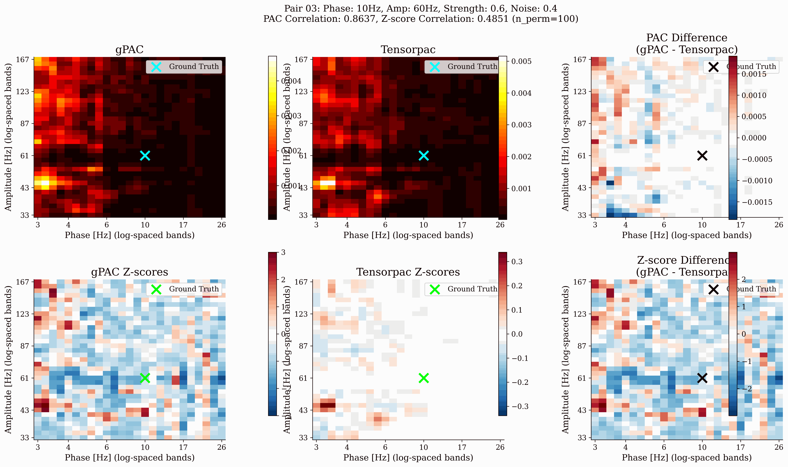
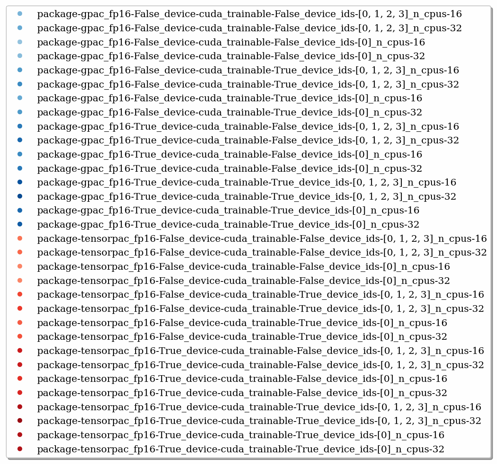
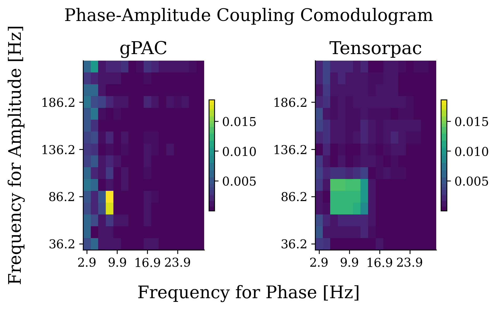

<!-- ---
!-- Timestamp: 2025-06-10 17:13:21
!-- Author: ywatanabe
!-- File: /ssh:ywatanabe@sp:/home/ywatanabe/proj/gPAC/README.md
!-- --- -->

# gPAC: GPU-Accelerated Phase-Amplitude Coupling

`gPAC` is a PyTorch-based package for efficient computation of Phase-Amplitude Coupling (PAC) using Modulation Index (MI) with GPU acceleration. It provides:

- **341.8x speedup** over TensorPAC (tested on real benchmarks)
- **Smart memory management** with auto/chunked/sequential strategies
- **Full differentiability** for deep learning integration
- **Production-ready** with comprehensive tests and examples
- **High correlation with TensorPAC** (0.81 ± 0.04 across diverse PAC configurations)

## 🎯 Example Applications

<div align="center">
  
  
  **Static PAC analysis with comodulogram visualization**
</div>

<div align="center">
  
  
  **Trainable PAC features for neural network classification**
</div>

## 🔬 Comparison with TensorPAC

<div align="center">
  
  
  **Example comparison: Phase 10Hz, Amplitude 60Hz (PAC Correlation: 0.847)**
  
  Shows side-by-side PAC comodulograms with ground truth markers (cyan crosses) and difference plots
</div>

<div align="center">
  
  
  **High correlation between gPAC and TensorPAC across 16 diverse PAC configurations**
  
  Mean correlation: 0.8113 ± 0.0419 (range: 0.7365 - 0.8585)
</div>

### Sample Comparison Results

<div align="center">
  <table>
    <tr>
      <td></td>
      <td></td>
    </tr>
    <tr>
      <td align="center"><b>Example 1:</b> Phase: 4Hz, Amp: 40Hz<br>PAC Correlation: 0.826</td>
      <td align="center"><b>Example 2:</b> Phase: 12Hz, Amp: 100Hz<br>PAC Correlation: 0.730</td>
    </tr>
  </table>
</div>

The comparison uses identical frequency bands (25 log-spaced phase bands × 35 log-spaced amplitude bands) for both methods, ensuring a fair comparison. Ground truth PAC locations are marked with crosses.

## 📊 Performance Benchmarks

<div align="center">
  
  
  **Parameter scaling comparison between gPAC (blue) and Tensorpac (red)**
</div>

<div align="center">
  
</div>

<div align="center">
  
  
  **Parameter Performance Analysis**
</div>


<div align="center">
  
  
  **PAC comodulogram comparison showing consistent results**
</div>


## 🚀 Quick Start

```bash
# Installation
pip install gpu-pac

# Or install from source
git clone https://github.com/ywatanabe1989/gPAC.git
cd gPAC
pip install -e .
```

### Quick Start

```python
import torch
from torch.utils.data import DataLoader
from gpac import PAC
from gpac.dataset import SyntheticDataGenerator

# Generate synthetic PAC dataset
generator = SyntheticDataGenerator(fs=512, duration_sec=2.0)
dataset = generator.dataset(n_samples=100, balanced=True)
dataloader = DataLoader(dataset, batch_size=32, shuffle=True)

# Method 1: Specify frequency range and number of bands
pac_model = PAC(
    seq_len=dataset[0][0].shape[-1],
    fs=512,
    pha_range_hz=(2, 20),    # Phase: 2-20 Hz
    pha_n_bands=10,          # 10 linearly spaced bands
    amp_range_hz=(30, 100),  # Amplitude: 30-100 Hz  
    amp_n_bands=10,          # 10 linearly spaced bands
)

# Method 2: Direct band specification (alternative)
# pac_model = PAC(
#     seq_len=dataset[0][0].shape[-1],
#     fs=512,
#     pha_bands_hz=[[4, 8], [8, 12], [12, 20]],      # Theta, Alpha, Beta
#     amp_bands_hz=[[30, 50], [50, 80], [80, 120]],  # Low, Mid, High Gamma
# )

# Move to GPU if available
device = 'cuda' if torch.cuda.is_available() else 'cpu'
pac_model = pac_model.to(device)

# Process a batch
for signals, labels, metadata in dataloader:
    signals = signals.to(device)
    
    # Calculate PAC
    results = pac_model(signals)
    pac_values = results['pac']  # Shape: (batch, channels, pha_bands, amp_bands)
    
    print(f"Batch PAC shape: {pac_values.shape}")
    print(f"Max PAC value: {pac_values.max().item():.3f}")
    
    # Access frequency band definitions
    print(f"Phase bands: {pac_model.pha_bands_hz}")  # Tensor of shape (n_pha, 2) with [low, high] Hz
    print(f"Amplitude bands: {pac_model.amp_bands_hz}")  # Tensor of shape (n_amp, 2) with [low, high] Hz
    break  # Just show first batch
```

For more examples, see the [examples directory](./examples/).

## 🔧 Core Features

### Flexible Frequency Band Configuration
- **Range-based**: Specify frequency range and number of bands for automatic spacing
- **Direct specification**: Define custom frequency bands for precise control
- **Standard bands**: Compatible with theta, alpha, beta, gamma conventions
- **High resolution**: Support for 50+ bands for detailed analysis
- **Band access**: Direct access to frequency band definitions via `pac.pha_bands_hz` and `pac.amp_bands_hz` properties

### GPU Optimization
- **Multi-GPU support**: Automatic data parallelism across GPUs
- **FP16 mode**: Half-precision computation for 2x memory efficiency
- **Torch compilation**: JIT compilation for additional speedup
- **Batch processing**: Efficient handling of multiple signals

### Scientific Features
- **Permutation testing**: Statistical validation with n_perm surrogates
- **Z-score normalization**: Automatic statistical significance testing
- **Modulation Index**: Standard MI calculation with 18 phase bins
- **Full differentiability**: Gradient support for deep learning applications

## 🤝 Contributing

Contributions are welcome! Please see our [contributing guidelines](CONTRIBUTING.md).

## 📖 Citation

If you use gPAC in your research, please cite:

```bibtex
@software{watanabe2025gpac,
  author = {Watanabe, Yusuke},
  title = {gPAC: GPU-Accelerated Phase-Amplitude Coupling},
  year = {2025},
  url = {https://github.com/ywatanabe1989/gPAC}
}
```

## 📄 License

This project is licensed under the MIT License - see the [LICENSE](LICENSE) file for details.

## 🙏 Acknowledgments

- TensorPAC team for the reference implementation
- For fair comparison with TensorPAC, use identical frequency bands as demonstrated in `./benchmark/pac_values_comparison_with_tensorpac/generate_16_comparison_pairs.py`

<!-- EOF -->