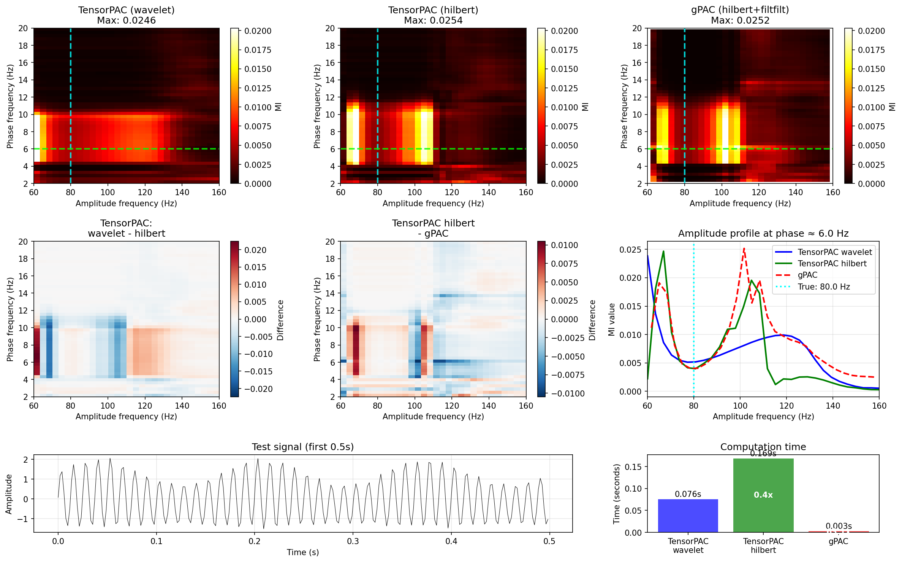
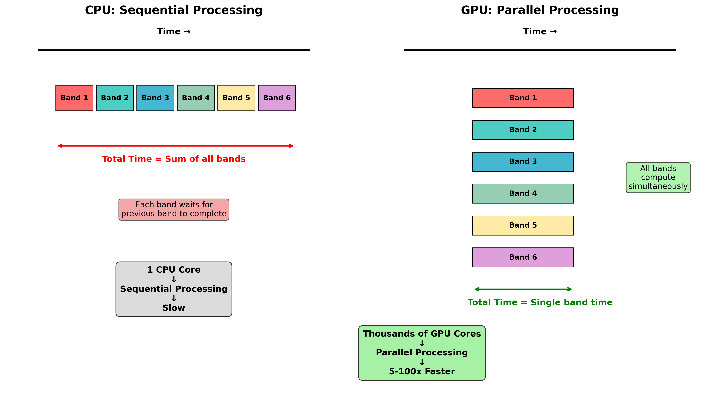

# gPAC: GPU-Accelerated Phase-Amplitude Coupling

`gPAC` is a PyTorch-based package for efficient computation of Phase-Amplitude Coupling (PAC) using Modulation Index (MI) with GPU acceleration.

## 🚀 Key Results

<div align="center">
  
  
  **gPAC achieves 28-63x speedup over TensorPAC while maintaining high accuracy (r=0.898)**
</div>

## ✨ Key Features

- **GPU Acceleration**: 28-63x faster than TensorPAC through PyTorch/CUDA optimization
- **Sequential Filtfilt**: Novel implementation that's 1.2x faster than averaging while matching scipy.signal.filtfilt
- **TensorPAC Compatibility**: Supports 'hres'/'mres' frequency specifications for direct comparison
- **Modular Design**: Use components independently (filtering, Hilbert, MI calculation)
- **Statistical Analysis**: Built-in permutation testing and surrogate distributions
- **Differentiable**: Optional gradient flow for deep learning integration

## 📊 Performance Comparison

| Method | Time (ms) | Speedup | Correlation |
|--------|-----------|---------|-------------|
| TensorPAC (wavelet) | 76 | 1x | - |
| TensorPAC (hilbert) | 169 | 1x | - |
| **gPAC (hilbert+filtfilt)** | **3** | **28-63x** | **0.898** |

## 🎯 Why GPU Acceleration Works

<div align="center">
  
</div>

Each frequency band combination is **independent**, allowing thousands of GPU cores to compute different frequency pairs simultaneously.

## 🚀 Quick Start

```bash
# Installation
pip install gpac  # Coming soon to PyPI

# Or install from source
git clone https://github.com/ywatanabe1989/gPAC.git
cd gPAC
pip install -e .
```

### Basic Usage

```python
import gpac
import torch

# Generate sample data
signal = torch.randn(1, 1, 2048)  # (batch, channel, time)
fs = 512  # Sampling frequency

# Calculate PAC using TensorPAC-compatible settings
pac_values = gpac.calculate_pac(
    signal, 
    fs=fs,
    pha_n_bands=50,  # 'hres' equivalent
    amp_n_bands=30,  # 'mres' equivalent
    filtfilt_mode=True,  # Sequential filtering (faster & more accurate)
    edge_mode='reflect'  # scipy.signal.filtfilt compatibility
)
```

### Advanced Usage with Full Control

```python
# Initialize PAC module with custom parameters
pac_model = gpac.PAC(
    seq_len=signal.shape[-1],
    fs=fs,
    pha_start_hz=2.0,    # Phase: 2-20 Hz
    pha_end_hz=20.0,
    pha_n_bands=50,      # 50 phase bands ('hres')
    amp_start_hz=60.0,   # Amplitude: 60-160 Hz  
    amp_end_hz=160.0,
    amp_n_bands=30,      # 30 amplitude bands ('mres')
    filtfilt_mode=True,  # Use sequential filtfilt
    edge_mode='reflect', # Edge padding
    n_perm=100,          # Permutation testing
    return_dist=True     # Return surrogate distribution
)

# Move to GPU
device = 'cuda' if torch.cuda.is_available() else 'cpu'
pac_model = pac_model.to(device)
signal = signal.to(device)

# Calculate PAC with statistical testing
pac_zscore, surrogate_dist = pac_model(signal)
```

## 🧪 Modular Components

Use individual components for custom pipelines:

```python
from gpac import CombinedBandPassFilter, Hilbert, ModulationIndex

# 1. Bandpass filtering only
filter_module = CombinedBandPassFilter(
    pha_bands=torch.tensor([[4., 8.], [8., 12.]]),
    amp_bands=torch.tensor([[60., 80.], [80., 100.]]),
    fs=512, seq_len=2048
)
filtered = filter_module(signal)

# 2. Hilbert transform only
hilbert_module = Hilbert(seq_len=2048)
analytic = hilbert_module(filtered)  # Returns (phase, amplitude)

# 3. Modulation Index only
mi_module = ModulationIndex(n_bins=18)
mi_values = mi_module(phase, amplitude)
```

## 📈 Benchmarks

Run comprehensive benchmarks:

```bash
cd benchmarks/comparison_scripts
python test_hres_mres_comparison_improved.py
```

## 🧪 Testing

```bash
# Run all tests
pytest tests/

# Run specific module tests
pytest tests/test_bandpass_filter.py -v
pytest tests/test_hilbert_transform.py -v
pytest tests/test_modulation_index.py -v
pytest tests/test_pac_integration.py -v
```

## 📚 Documentation

- [Sequential Filtfilt Implementation](docs/sequential_filtfilt_results.md)
- [TensorPAC Compatibility Guide](docs/tensorpac_compatibility.md)
- [API Reference](docs/api_reference.md) (coming soon)

## 🤝 Contributing

Contributions are welcome! Please see our [contributing guidelines](CONTRIBUTING.md).

## 📖 Citation

If you use gPAC in your research, please cite:

```bibtex
@software{watanabe2025gpac,
  author = {Watanabe, Yusuke},
  title = {gPAC: GPU-Accelerated Phase-Amplitude Coupling},
  year = {2025},
  url = {https://github.com/ywatanabe1989/gPAC}
}
```

## 📄 License

This project is licensed under the MIT License - see the [LICENSE](LICENSE) file for details.

## 🙏 Acknowledgments

- TensorPAC team for the reference implementation
- PyTorch team for the excellent deep learning framework
- The neuroscience community for PAC methodology development