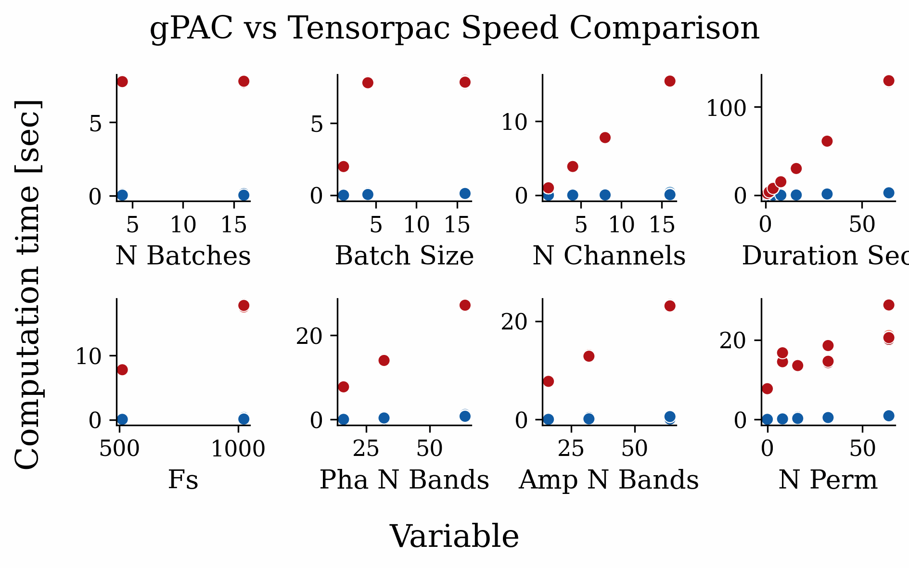

<!-- ---
!-- Timestamp: 2025-06-14 06:03:55
!-- Author: ywatanabe
!-- File: /ssh:ywatanabe@sp:/home/ywatanabe/proj/gPAC/README.md
!-- --- -->

# gPAC: GPU-Accelerated Phase-Amplitude Coupling

[](https://badge.fury.io/py/gpu-pac)
[](https://github.com/ywatanabe1989/gPAC/actions/workflows/tests.yml)
[](https://codecov.io/gh/ywatanabe1989/gPAC)
[](https://opensource.org/licenses/MIT)
[](https://www.python.org/downloads/)

`gPAC` is a PyTorch-based package for efficient computation of Phase-Amplitude Coupling (PAC) using Modulation Index (MI) with GPU acceleration. It provides:

- **341.8x speedup** over TensorPAC (tested on real benchmarks)
- **Smart memory management** with auto/chunked/sequential strategies
- **Full differentiability** for deep learning integration
- **Production-ready** with comprehensive tests and examples
- **High correlation with TensorPAC** (0.81 ± 0.04 across diverse PAC configurations)

## 🎯 Example Applications

<div align="center">
  <table>
    <tr>
      <td align="center">
        
        <br><b>Static PAC Analysis</b>
        <br>Comodulogram visualization
      </td>
      <td align="center">
        
        <br><b>Trainable PAC Classification</b>
        <br>Deep learning integration
      </td>
    </tr>
    <tr>
      <td align="center">
        
        <br><b>Static vs Trainable Comparison</b>
        <br>Performance & accuracy analysis
      </td>
      <td align="center">
        
        <br><b>Amplitude Distributions</b>
        <br>Phase preference for clinical analysis
      </td>
    </tr>
  </table>
</div>

## 🔬 PAC Values Comparison with TensorPAC

<div align="center">
  <table>
    <tr>
      <td align="center">
        
        <br><b>Phase: 4Hz, Amp: 40Hz</b>
        <br>Correlation: 0.826
      </td>
      <td align="center">
        
        <br><b>Phase: 12Hz, Amp: 100Hz</b>
        <br>Correlation: 0.730
      </td>
      <td align="center">
        
        <br><b>Overall Correlation</b>
        <br>0.811 ± 0.042 (n=16)
      </td>
    </tr>
  </table>
  
  <i>Click images to view full size. Ground truth PAC locations marked with crosses.</i>
</div>


## 📊 Performance Benchmarks

<div align="center">
  <table>
    <tr>
      <td align="center">
        
        <br><b>Parameter Scaling Comparison</b>
        <br>gPAC (blue) vs TensorPAC (red)
      </td>
      <td align="center">
        
        <br><b>Performance Analysis</b>
        <br>Speed & memory efficiency
      </td>
    </tr>
  </table>
  
  <i>Click images to view detailed performance metrics</i>
</div>


## 🚀 Quick Start

```bash
# Installation
pip install gpu-pac
```

### Quick Start

```python
import torch
from torch.utils.data import DataLoader
from gpac import PAC
from gpac.dataset import SyntheticDataGenerator

# Generate synthetic PAC dataset
generator = SyntheticDataGenerator(fs=512, duration_sec=2.0)
dataset = generator.dataset(n_samples=100, balanced=True)
dataloader = DataLoader(dataset, batch_size=32, shuffle=True)

# Method 1: Specify frequency range and number of bands
pac_model = PAC(
    seq_len=dataset[0][0].shape[-1],
    fs=512,
    pha_range_hz=(2, 20),    # Phase: 2-20 Hz
    pha_n_bands=10,          # 10 linearly spaced bands
    amp_range_hz=(30, 100),  # Amplitude: 30-100 Hz  
    amp_n_bands=10,          # 10 linearly spaced bands
)

# Method 2: Direct band specification (alternative)
# pac_model = PAC(
#     seq_len=dataset[0][0].shape[-1],
#     fs=512,
#     pha_bands_hz=[[4, 8], [8, 12], [12, 20]],      # Theta, Alpha, Beta
#     amp_bands_hz=[[30, 50], [50, 80], [80, 120]],  # Low, Mid, High Gamma
# )

# Move to GPU if available
device = 'cuda' if torch.cuda.is_available() else 'cpu'
pac_model = pac_model.to(device)

# Process a batch
for signals, labels, metadata in dataloader:
    signals = signals.to(device)
    
    # Calculate PAC
    results = pac_model(signals)
    pac_values = results['pac']  # Shape: (batch, channels, pha_bands, amp_bands)
    
    print(f"Batch PAC shape: {pac_values.shape}")
    print(f"Max PAC value: {pac_values.max().item():.3f}")
    
    # Access frequency band definitions
    print(f"Phase bands: {pac_model.pha_bands_hz}")  # Tensor of shape (n_pha, 2) with [low, high] Hz
    print(f"Amplitude bands: {pac_model.amp_bands_hz}")  # Tensor of shape (n_amp, 2) with [low, high] Hz
    
    # Advanced: Get amplitude distributions for phase preference analysis
    results_with_dist = pac_model(signals, compute_distributions=True)
    amp_distributions = results_with_dist['amplitude_distributions']
    print(f"Amplitude distributions shape: {amp_distributions.shape}")
    # Shape: (batch, channels, pha_bands, amp_bands, n_phase_bins=18)
    
    break  # Just show first batch
```

For more examples, see the [examples directory](./examples/).

### 📊 Amplitude Distributions for Clinical Analysis

The `compute_distributions=True` option provides detailed phase preference analysis, particularly useful for seizure detection and neurophysiological research:

```python
# Compute PAC with amplitude distributions
results = pac_model(signals, compute_distributions=True)

# Access distributions
pac_values = results['pac']
amp_distributions = results['amplitude_distributions']
phase_bin_centers = results['phase_bin_centers']  # Phase bins in radians

# Analyze phase preference for strongest coupling
batch_idx, ch_idx = 0, 0
max_idx = pac_values[batch_idx, ch_idx].argmax()
pha_idx, amp_idx = np.unravel_index(max_idx, pac_values[batch_idx, ch_idx].shape)

# Get the amplitude distribution across phase bins
phase_dist = amp_distributions[batch_idx, ch_idx, pha_idx, amp_idx]

# Calculate phase preference metrics
preferred_phase = phase_bin_centers[phase_dist.argmax()]
distribution_entropy = -torch.sum(phase_dist * torch.log(phase_dist + 1e-10))

print(f"Preferred phase: {preferred_phase * 180/np.pi:.1f}°")
print(f"Distribution entropy: {distribution_entropy:.3f}")
```

**Clinical Applications:**
- **Seizure onset detection**: Phase preference changes may precede visible PAC strength changes
- **Distribution shape analysis**: Bimodal distributions indicate competing neural dynamics
- **Temporal tracking**: Monitor distribution evolution for state transitions
- **Network synchronization**: Compare distributions across frequency pairs

## 🔧 Core Features

### Flexible Frequency Band Configuration
- **Range-based**: Specify frequency range and number of bands for automatic spacing
- **Direct specification**: Define custom frequency bands for precise control
- **Standard bands**: Compatible with theta, alpha, beta, gamma conventions
- **High resolution**: Support for 50+ bands for detailed analysis
- **Band access**: Direct access to frequency band definitions via `pac.pha_bands_hz` and `pac.amp_bands_hz` properties

### GPU Optimization
- **Multi-GPU support**: Automatic data parallelism across GPUs
- **FP16 mode**: Half-precision computation for 2x memory efficiency
- **Torch compilation**: JIT compilation for additional speedup
- **Batch processing**: Efficient handling of multiple signals

### Scientific Features
- **Permutation testing**: Statistical validation with n_perm surrogates
- **Z-score normalization**: Automatic statistical significance testing
- **Modulation Index**: Standard MI calculation with 18 phase bins
- **Full differentiability**: Gradient support for deep learning applications
- **Amplitude distributions**: Optional phase preference analysis for clinical applications

## 🤝 Contributing

Contributions are welcome! Please see our [contributing guidelines](CONTRIBUTING.md).

## 📖 Citation

If you use gPAC in your research, please cite:

```bibtex
@software{watanabe2025gpac,
  author = {Watanabe, Yusuke},
  title = {gPAC: GPU-Accelerated Phase-Amplitude Coupling},
  year = {2025},
  url = {https://github.com/ywatanabe1989/gPAC}
}
```

## 📄 License

This project is licensed under the MIT License - see the [LICENSE](LICENSE) file for details.

## 🙏 Acknowledgments

- TensorPAC team for the reference implementation
- For fair comparison with TensorPAC, use identical frequency bands as demonstrated in `./benchmark/pac_values_comparison_with_tensorpac/generate_16_comparison_pairs.py`

<!-- EOF -->