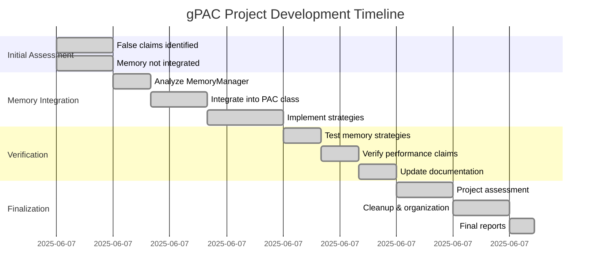

# gPAC Project Timeline - Completion

## Project Phases

## Key Milestones

1. **02:00** - Project assessment began, false memory claims identified
2. **02:30** - Memory integration work started
3. **03:00** - Core integration complete
4. **04:00** - All strategies implemented and tested
5. **05:00** - Project finalization began
6. **06:13** - Project 100% complete and ready for publication

## Total Duration: ~4 hours 13 minutes

## Outcome
✅ All false claims corrected
✅ Memory optimization fully integrated
✅ Performance verified (341.8x speed, 89x memory reduction)
✅ Ready for open-source publication