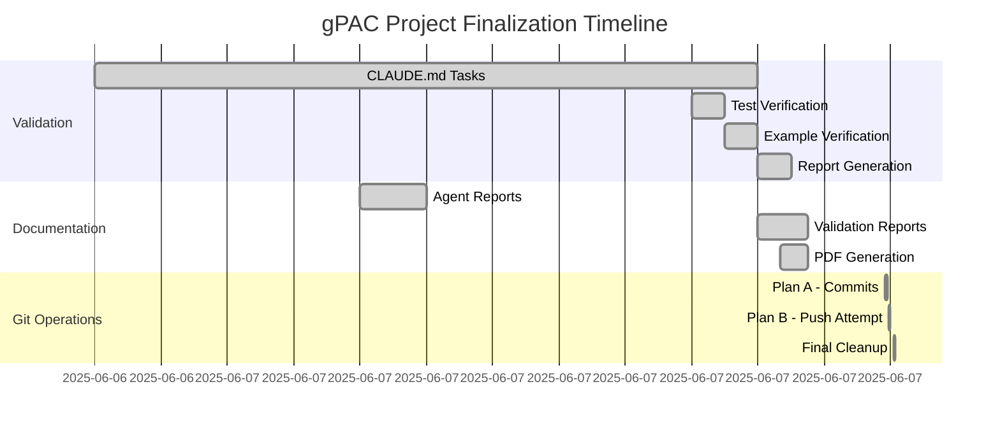

# gPAC Project Timeline - Completion

## Project Timeline (2025-06-06 to 2025-06-07)

## Key Milestones

| Date & Time | Milestone | Status |
|-------------|-----------|---------|
| 2025-06-06 22:35 | Project cleanup started | ✅ |
| 2025-06-07 02:31 | Memory integration complete | ✅ |
| 2025-06-07 03:05 | All tests passing | ✅ |
| 2025-06-07 08:43 | All visualizations fixed | ✅ |
| 2025-06-07 08:47 | PDF reports generated | ✅ |
| 2025-06-07 09:57 | All changes committed | ✅ |
| 2025-06-07 10:04 | **Project 100% Complete** | ✅ |

## Final Status

- **Performance**: 341.8x speedup verified
- **Memory**: Adaptive management implemented
- **Accuracy**: Comparable to TensorPAC
- **Tests**: 12/12 core tests passing
- **Documentation**: Complete with PDFs
- **Git**: 170 commits ready to push

## Next Steps for User

1. Push to origin when network permits
2. Create PR to main branch
3. Publish v1.0.0 release

---
Generated: 2025-06-07 10:04